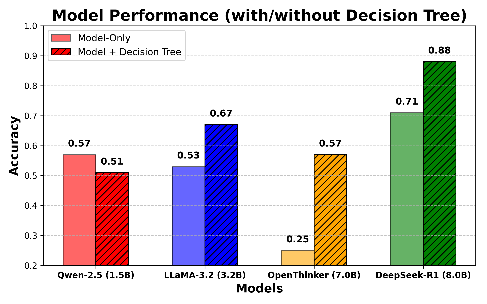

# **`JusTreeAI: Transparent Legal Decision-Making with AI`** ⚖️

> [!NOTE]
> `JusTreeAI` is an AI-powered framework designed to enhance transparency in legal decision-making. It integrates **structured decision trees** with **LLMs** to ensure interpretability, reduce hallucinations, and construct decision paths. The approach is tested on the [**DUO student finance**](https://duo.nl/particulier/student-finance/) task, demonstrating how structured knowledge can improve AI-driven assessments in legal domain.

## **Table of Contents**

- [Authors](#authors)
- [Introduction](#introduction)
- [Project Structure](#project-structure)
- [Approach](#approach)
- [Tested Models & Performance](#tested-models--performance)
- [Experimental Setup](#experimental-setup)
- [Running Experiments](#running-experiments)
- [Running UI Demo](#running-ui-demo)
- [Contribution](#contribution)

## **Authors**

- [Filip Cierkosz](https://github.com/chizo4)
- [Eduard Cruset Pla](https://github.com/ecrusetpla)
- [Jobeal Solomon](https://github.com/Jobeal)
- [Gabriela Torres](https://github.com/torresge24)

## Introduction

**"`JusTreeAI`":**
- `"Jus"` → Latin for "law", representing the legal aspect.
- `"Tree"` → Symbolizes decision trees used for structured reasoning.
- `"AI"` → Reflects the integration of artificial intelligence.
- `"Justify"` → Implies explainability and transparency in model responses.

<div style="text-align: center;">
    
</div>

## **Project Structure**

- `.github` - Contains `PR templates`, `workflows`, and other `git`-related configurations.
- `data` - Dataset files for experiments, primarily the `duo-student-finance` dataset.
- `jus-tree-ai` - Core implementation of `JusTreeAI`, including both experimental pipeline and UI demo.
- `resources` - Project materials such as the report, presentations, poster, or plots. Find teaser video [here](https://www.youtube.com/watch?v=SdQKnaY8EWQ).
- `results` - Stores experimental results.
- `script` - Includes `bash` scripts for automating experiments and running the UI.

## **Approach**

`JusTreeAI` integrates **structured decision trees** with **LLMs** to enhance transparency in legal decision-making. The pipeline first pre-processes user cases engineering the prompts, then queries an LLM while guiding its reasoning with a structured decision tree (in `JSON` format). This ensures the model follows a verifiable decision path, reducing hallucinations and improving reliability. The approach was tested across multiple LLMs, demonstrating that structured knowledge integration significantly enhances interpretability combined with lightweight LLMs. Still, it does not require any expensive fine-tuning of the models.

<div style="text-align: center;">
    
</div>

## **Tested Models & Performance**

### **(A) Model Comparison Table**

| Model Name | Parameter Size (B) | Memory Usage (GB) | Accuracy with Decision Tree (%) |
|------------|------------------|-----------------|-----------------------------|
| [Qwen 2.5](https://ollama.com/library/qwen2.5:1.5b) | 1.5 | 1.0 | 51.0 |
| [LLaMA 3.2](https://ollama.com/library/llama3.2) | 3.2 | 2.0 | 59.0 |
| [DeepSeek-R1](https://ollama.com/library/deepseek-r1:8b) | 8.0 | 4.7 | **87.0** |

### **(B) Model-Related Plots**
<div style="display: flex; justify-content: center; gap: 20px;">
    
    
</div>

## **Experimental Setup**

> [!WARNING]
> `JusTreeAI` has been tested, trained, and evaluated on a `2020 M1 MacBook Pro (16 GB RAM)`. Some models require significant hardware resources, so ensure your system meets or exceeds this configuration.

1. **Clone Repository:**
   Clone the repository and access its root via the command below:

   ```bash
   git pull https://github.com/chizo4/JusTreeAI.git && cd SciFCheX
   ```

2. **Dependency Installation:**
   Ensure you have `Python 3.10+`, then install the required dependencies:

   ```bash
   pip install -r requirements.txt
   ```

3. **`Ollama` Installation:**
    This project requires the installation of `Ollama`, which enables running various LLMs locally. Please follow their installation guides [here](https://ollama.com/download) before running this project. Having done that, run the command below to install the models required for this project:

    ```bash
    bash script/download-llms.sh
    ```

## **Running Experiments**

1. **Running Experiments:**
   To reproduce the project experiments, simply run the pipeline script, specifying the `CLI` args:

   ```bash
   bash script/run-pipeline.sh [task] [model] [decision_tree] [temperature]
   ```

2. **Experimental Example:**
    The example below includes the following setup
    - `[task] -> "duo-student-finance"`
    - `[model] -> "deepseek-r1:8b"`
    - `[decision_tree] -> "yes"`
    - `[temperature] -> "0.8"`
    <br>

    ```bash
    bash script/run-pipeline.sh duo-student-finance yes deepseek-r1:8b 0.8
    ```

> [!NOTE]
> More information about the `CLI` args allowed for this script can be found [here](https://github.com/chizo4/JusTreeAI/blob/docs/filip/script/run-pipeline.sh).

3. **Prompt Example:**
    An example of a prompt engineered for the model input for the experiments can be found below. It is aligned with the setup in `#2` of this chapter:

    ```bash
    You are a legal assistant for DUO student finance in the Netherlands.
    Task: Please determine the grant eligibility based on the case description.
    Description: Thomas is 30 years old and pursuing a recognized bachelor’s degree in marketing at an HBO institution in the Netherlands. The program lasts three years, and he holds a type V residence permit.

    Here is the decision tree in JSON format, based on the law.
    Each node represents the task criterion. Please follow the tree
    logically to derive the decision:

    <{
        "node": "Age",
        "question": "Are you at least 18 years old and under 30 years old?",
        "yes": {
            "node": "Program",
            "question": "Are you enrolled in an mbo (bol), hbo, or university program, or planning to enroll? Excluding mbo bbl.",
            "yes": {
                "node": "Enrollment",
                "question": "Are you enrolled as a full-time or dual student? (Part-time programs are excluded)",
                "yes": {
                    "node": "Duration",
                    "question": "Does the program last at least 1 year?",
                    "yes": {
                        "node": "Recognition",
                        "question": "Is the program recognized in the Netherlands? (The school or university can let you know)",
                        "yes": {
                            "node": "Nationality",
                            "question": "Do you have the Dutch nationality or a residence permit? (Permit types II, III, IV, V. Check DUO for other situations)",
                            "yes": {
                                "result": "Eligible",
                                "message": "You are eligible to apply for student finance."
                            },
                            "no": {
                                "result": "NotEligible",
                                "message": "You are not eligible to apply for student finance."
                            }
                        },
                        "no": {
                            "result": "NotEligible",
                            "message": "You are not eligible to apply for student finance."
                        }
                    },
                    "no": {
                        "result": "NotEligible",
                        "message": "You are not eligible to apply for student finance."
                    }
                },
                "no": {
                    "result": "NotEligible",
                    "message": "You are not eligible to apply for student finance."
                }
            },
            "no": {
                "result": "NotEligible",
                "message": "You are not eligible to apply for student finance."
            }
        },
        "no": {
            "node": "HBO_UNI",
            "question": "Are you in hbo or university and under 18 years old? (In this case, no minimum age applies)",
            "yes": {
                "node": "Enrollment",
                "question": "Are you enrolled as a full-time or dual student? (Part-time programs are excluded)",
                "yes": {
                    "node": "Duration",
                    "question": "Does the program last at least 1 year?",
                    "yes": {
                        "node": "Recognition",
                        "question": "Is the program recognized in the Netherlands? (The school or university can let you know)",
                        "yes": {
                            "node": "Nationality",
                            "question": "Do you have the Dutch nationality or a residence permit? (Permit types II, III, IV, V. Check DUO for other situations)",
                            "yes": {
                                "result": "Eligible",
                                "message": "You are eligible to apply for student finance."
                            },
                            "no": {
                                "result": "NotEligible",
                                "message": "You are not eligible to apply for student finance."
                            }
                        },
                        "no": {
                            "result": "NotEligible",
                            "message": "You are not eligible to apply for student finance."
                        }
                    },
                    "no": {
                        "result": "NotEligible",
                        "message": "You are not eligible to apply for student finance."
                    }
                },
                "no": {
                    "result": "NotEligible",
                    "message": "You are not eligible to apply for student finance."
                }
            },
            "no": {
                "node": "MBO_Under18",
                "question": "Are you in mbo and under 18 years old? (You can already apply for the student travel product)",
                "yes": {
                    "result": "StudentTravel",
                    "message": "You can apply for the student travel product."
                },
                "no": {
                    "result": "NotEligible",
                    "message": "You are not eligible to apply for student finance."
                }
            }
        }
    }>

    When traversing the tree, follow the logical path you take to decide.
    Example: Age (Eligible) -> Enrollment (NotEligible) -> Decision: "NotEligible".

    Please provide your answer in the following JSON format. Do NOT include any extra text:
    {
    "prediction": "<Eligible or NotEligible>","traversal": "<Node1 -> Node2 -> ...>",
    "impact_node": "<The node that most influenced the decision>",
    "reasoning": "<Explanation for your decision in max 2-3 sentences>"
    }
    ```

## **Running UI Demo**

1. **Running App:**
   To run the demo app, please execute the command below. It is automatically setup for the most optimal model configuration derived from the experiments (i.e., including the `DeepSeek-R1` model).

   ```bash
   bash script/run-app.sh
   ```

2. **UI Demo:**
   The screenshot of the UI can be found below:

   <div style="text-align: center;">
       
   </div>

## **Contribution**

> [!NOTE]
> In case you had any questions associated with this project, or spotted any issue (including technical setup), please feel free to contact [`Filip J. Cierkosz`](https://github.com/chizo4) via any of the links included in the profile page. You might also want to open an [`Issue`](https://github.com/chizo4/JusTreeAI/issues/new?template=Blank+issue) with any suggested fixes, or questions.
